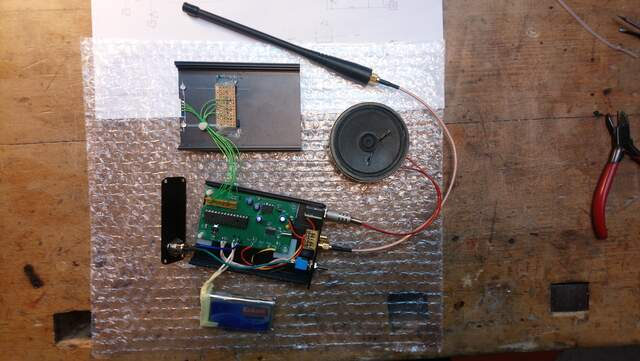
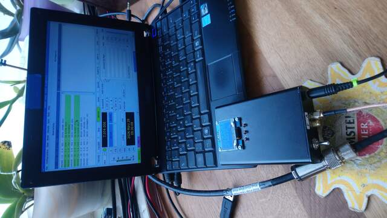

# si4735_miniradio
SI4735-D60 Circuit and Arduino Sketech for Building a SW/FM Radio with 150kHz..30MHz AM/SSB + 64-108MHz FM

### some details
- i am using a 7.2V LiPo, which is directly connencted to the lm386 - it can have about 5-12V
- the mcu and the radio chip SI4735-D60-GU is driven with a LM1117-3.3 with 3.3V, that is important for the SI4735, and enough for an ATMEGA328

### some modifications (which will be in v2 circuit) are made after this circuit(v1):

- add a reset knob between pin 1 of atmega328-pu and gnd for programming from outside.
- insert a 1k2 resistor between pin 1 of lm386 and the 10µ c at pin 8, because gain of 50 is enough.
- my first circuit (the one with the case) i used sockets and plugs for programming outside, but i recommend to solder the AT328 directly and dont use the plugs on the circuit, instead use direct wires for getting more place in the case. Also i used another CA5 

### hints for using
- left button is "down", middle button is "mode", right button is "up"
- you have a preview of the mode right of the mode which has the star in front.
- frequency display has as suffix its step with a slash, also bfo 
- to lock, press up or down in lock mode; to unlock, use up and down simultaneous

																	  
																	  
																	
if you have any questions, feel free to ask me: dm2hr@darc.de
